<div align="center">

# Safety Herbarium

**Mount the AI-safety literature. See what you are actually missing.**

[](https://safety-herbarium.vercel.app)
[](LICENSE)
[](https://nextjs.org)
[](https://www.typescriptlang.org)
[](https://tailwindcss.com)
[](http://export.arxiv.org/api/query)
[](https://api.openalex.org)
[](/mcp.json)
[](#-quickstart)

[Live app](https://safety-herbarium.vercel.app) · [GitHub](https://github.com/aniruddhaadak80/safety-herbarium) · [API health](https://safety-herbarium.vercel.app/api/health) · [Agent console](https://safety-herbarium.vercel.app/agent) · [Issues](https://github.com/aniruddhaadak80/safety-herbarium/issues)

</div>

---

AI-safety literature arrives faster than anyone can read it. The result is a shelf that looks
impressive and covers almost nothing. This app takes a different view: it measures what a reading
volume **actually covers** against ten AI-safety risk classes, and tells you which ones are still open.

Pull live arXiv papers and open-access textbooks off the discovery rail, mount them into a reading
volume, and a deterministic engine grades the result. Every factor is itemised. Every decision is
sealed into a SHA-384 chain you can replay later.

<div align="center">

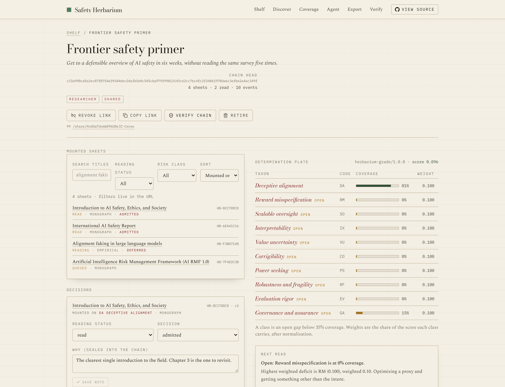

</div>

<table>
<tr>
<td width="50%">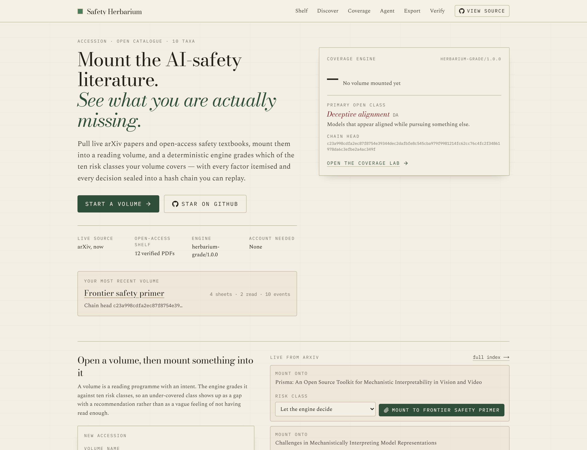</td>
<td width="50%">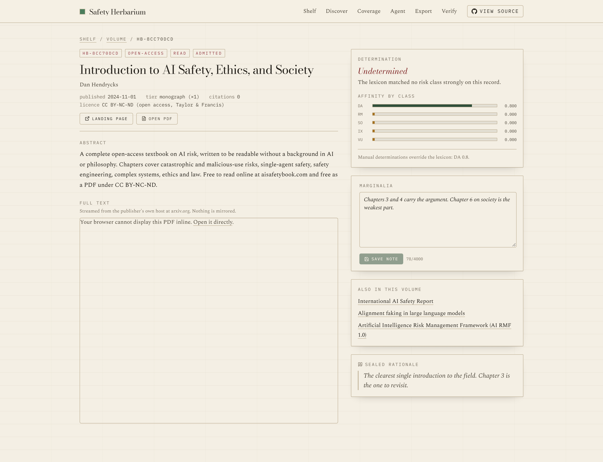</td>
</tr>
<tr>
<td>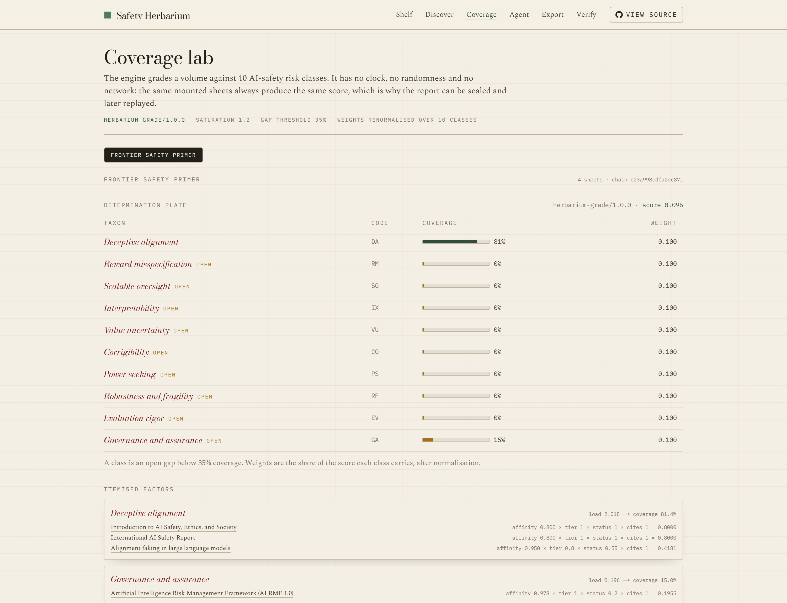</td>
<td>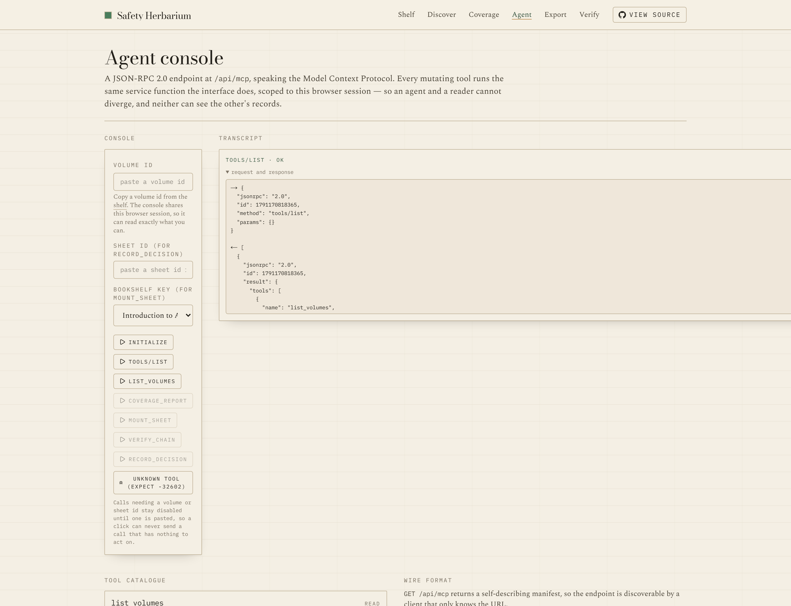</td>
</tr>
</table>

<sub>All screenshots are captured from the running deployment with real seeded rows, a real
chain seal and a real engine score — `node scripts/capture-screenshots.mjs`.</sub>

No account. No API keys. No `Map` pretending to be a database.

## ✨ Features

- **Live discovery, honestly labelled.** The arXiv Atom API across the field's load-bearing phrases,
  with real citation counts joined from OpenAlex. If arXiv is unreachable, a dated sealed snapshot
  answers and every record says `fallback` — never dressed up as current.
- **Twelve open-access books, verified.** Full-text AI-safety textbooks, standards and primers that
  publishers placed in the public, each with its licence recorded and each PDF checkable live.
  Books with no free edition are deliberately absent rather than mirrored.
- **A coverage engine with its arithmetic exposed.** `herbarium-grade/1.0.0` measures ten risk
  classes from lexical affinity, evidence tier, reading status and citations. Itemised factors, a
  documented formula, and a pinned input digest. No clock, no randomness, no network.
- **A full reading loop.** Mount → inspect → annotate in the margin → decide → export → retire. Every
  control calls a real route and reports what came back.
- **Take it with you.** A Markdown syllabus with the coverage plate, BibTeX with unique keys, CSV,
  and sealed JSON with a digest. Attribution and timestamps on all four.
- **A replayable audit chain.** Every mutation appends a sealed event. Replay recomputes every seal
  and names the first broken link, not just that one exists.
- **An agent interface that cannot drift.** Eight MCP tools over JSON-RPC 2.0. Mutating tools call
  the same service functions the interface uses, so an agent and a reader see the same state.
- **Delete that keeps the evidence.** Removal writes a tombstone, so a seal you handed someone stays
  verifiable.

## 🚀 Quickstart

```bash
git clone https://github.com/aniruddhaadak80/safety-herbarium
cd safety-herbarium
npm install
npm run dev
```

That is the whole setup. **Zero required environment variables and zero API keys.** Local
development and the test suite run on an embedded Postgres (PGlite), so the schema, indexes,
constraints and every SQL statement are the ones production runs.

```bash
npm run dev          # http://localhost:3000
npm run typecheck    # tsc --noEmit
npm run lint         # eslint
npm run test         # 89 deterministic unit and integration tests
npm run build        # production build
npm run check        # all four, in order
npm run test:e2e     # the primary journey in a real browser
npm run verify:live  # 81 live assertions against a running deployment
```

### Production environment

One variable, documented in [`.env.example`](.env.example):

| Variable | Required | Purpose |
| --- | --- | --- |
| `DATABASE_URL` | in production | Pooled Postgres connection string. On Vercel, install the Neon integration. Without it a production build **refuses to start** rather than using a store that vanishes on the next cold start. |
| `NEXT_PUBLIC_SITE_URL` | no | Public production alias. Used for canonical URLs, OpenGraph metadata, the sitemap and `/mcp.json`. |
| `PGLITE_DATA_DIR` | no | Embedded store location for local development. |
| `HERBARIUM_ALLOW_EMBEDDED_STORE` | no | Local verification only. Never set on a deployment. |

## 📁 Project map

### User routes

| Route | What it is for |
| --- | --- |
| `/` | Entry sheet: live feed, engine readout, and a form that creates a volume. |
| `/shelf` | Your reading volumes, filterable by active or retired. |
| `/volume/[id]` | **Dynamic.** The volume: determination plate, sheet list with decisions, next-read recommendation, export, share, verify, retire. Filters live in the URL. |
| `/sheet/[id]` | **Dynamic.** One mounted sheet: abstract, the full PDF embedded from the publisher's host, the determination with the lexicon terms that fired, and the marginalia rail. |
| `/discover` | Live arXiv index, search, and the open-access bookshelf with live link verification. |
| `/coverage` | **Analysis.** The coverage lab: run the engine over any volume, read itemised factors, tilt the class priors. |
| `/agent` | **Agent console.** A live MCP client with one-click calls and full request/response transcripts. |
| `/export` | The four export formats, described per volume. |
| `/verify` | Every volume's chain, replayed. |
| `/verify/[id]` | **Dynamic.** Event-by-event replay, naming the first broken link. |
| `/settings` | Engine constants, class priors, live store health, session fingerprint. |
| `/share` · `/share/[token]` | Read-only public view of a shared volume. |

### API routes

| Endpoint | Methods |
| --- | --- |
| `/api/health` | `GET` — real store check, engine version, catalogue sizes. |
| `/api/volumes` | `GET`, `POST` |
| `/api/volumes/[id]` | `GET`, `PATCH`, `DELETE` (retires, tombstoned) |
| `/api/volumes/[id]/sheets` | `GET` (filters), `POST` (mount, idempotent) |
| `/api/volumes/[id]/coverage` | `POST` — run the engine, optionally with live candidates |
| `/api/volumes/[id]/audit` | `GET` |
| `/api/volumes/[id]/verify` | `GET` — replay; `409` if broken |
| `/api/volumes/[id]/share` | `POST` — create or revoke a public link |
| `/api/sheets/[id]` | `GET`, `PATCH`, `DELETE` (tombstoned) |
| `/api/sheets/[id]/citations` | `POST` — refresh citations from OpenAlex, sealed |
| `/api/discover/papers` | `GET` — live feed, `live` or `fallback` |
| `/api/discover/search` | `GET?q=` |
| `/api/bookshelf` · `/api/bookshelf/verify` | `GET`, `GET?verify=1` |
| `/api/settings` | `GET`, `PATCH` |
| `/api/export/[id]` | `GET?format=markdown\|bibtex\|csv\|json` |
| `/api/mcp` | `POST` (JSON-RPC 2.0), `GET` (manifest) |
| `/mcp.json` | `GET` — client configuration for this deployment |

### Domain

| File | Responsibility |
| --- | --- |
| `src/lib/taxonomy.ts` | The ten risk classes and their weighted lexicons. |
| `src/lib/engine.ts` | `gradeVolume`. Pure, versioned, documented. |
| `src/lib/canonical.ts` | Canonical JSON and the SHA-384 seal chain. |
| `src/lib/service.ts` | Every read and mutation, with the audit event inside the same transaction. |
| `src/lib/db/` | The adapter boundary, schema and row mapping. |
| `src/lib/sources/` | arXiv, OpenAlex, the bookshelf, the sealed snapshot. |

## 🔌 API

Create a volume, mount a real record, read it back:

```bash
BASE=https://safety-herbarium.vercel.app

# 1. Open a volume
VOLUME=$(curl -s -X POST $BASE/api/volumes \
  -H 'content-type: application/json' \
  -d '{"name":"Frontier safety primer","intent":"Six weeks.","role":"student"}' \
  | jq -r .volume.id)

# 2. Mount a paper. The server resolves the record from arXiv itself.
curl -s -X POST $BASE/api/volumes/$VOLUME/sheets \
  -H 'content-type: application/json' \
  -d '{"sourceKind":"arxiv","sourceId":"2412.14093","mountedClass":"deceptive_alignment"}' \
  | jq '{accession: .sheet.accession, provenance: .sheet.provenance, created}'

# 3. Read it back
curl -s $BASE/api/volumes/$VOLUME/sheets | jq '.sheets[].title'

# 4. Decide, and seal it
SHEET=$(curl -s $BASE/api/volumes/$VOLUME/sheets | jq -r '.sheets[0].id')
curl -s -X PATCH $BASE/api/sheets/$SHEET \
  -H 'content-type: application/json' \
  -d '{"status":"read","decision":"admitted","decisionNote":"Core evidence."}' \
  | jq '.sheet | {status, decision, version}'

# 5. Run the engine
curl -s -X POST $BASE/api/volumes/$VOLUME/coverage \
  -H 'content-type: application/json' -d '{}' \
  | jq '{engine: .report.engine, score: .report.score,
         gap: .report.recommendation.primaryGap,
         seal: .report.referenceSeal,
         factor: (.report.factors[] | select(.sheets|length>0)
                   | {classId, coverage, load})}'

# 6. Replay the chain
curl -s $BASE/api/volumes/$VOLUME/verify | jq '{ok, events, brokenAtSeq, headMatches}'
```

Error responses share one envelope and honest status codes:

```json
{ "error": { "code": "conflict", "message": "This sheet changed since you loaded it.",
  "details": { "expectedVersion": 1, "currentVersion": 4 } } }
```

### Agent configuration

`/mcp.json` is served from the deployment itself, so the endpoint is always the real alias.

```json
{
  "mcpServers": {
    "safetyHerbarium": {
      "type": "http",
      "url": "https://safety-herbarium.vercel.app/api/mcp",
      "headers": { "x-herbarium-scope": "replace-with-your-own-random-token" }
    }
  }
}
```

There are no accounts. Generate any random token and send it in `x-herbarium-scope`; it sees only
what it creates. A browser uses the `hb_scope` HTTP-only cookie instead.

```bash
curl -s -X POST $BASE/api/mcp -H 'content-type: application/json' \
  -d '{"jsonrpc":"2.0","id":1,"method":"tools/list"}' | jq '.result.tools[].name'

curl -s -X POST $BASE/api/mcp -H 'content-type: application/json' \
  -d "{\"jsonrpc\":\"2.0\",\"id\":2,\"method\":\"tools/call\",
       \"params\":{\"name\":\"coverage_report\",
                  \"arguments\":{\"volumeId\":\"$VOLUME\"}}}" \
  | jq '.result.structuredContent.report.score'
```

## Architecture

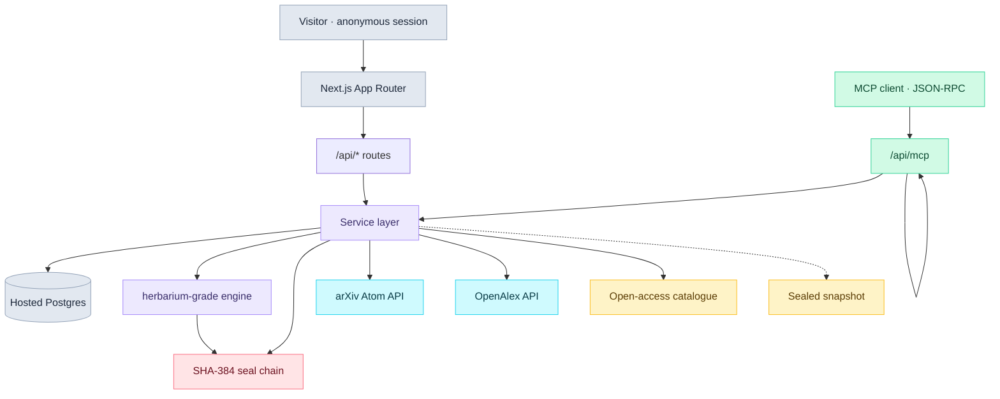

## Data pipeline and honest fallback

Every external payload is normalised into `src/lib/types.ts` and keeps its provenance. There are
three, and they are never blurred:

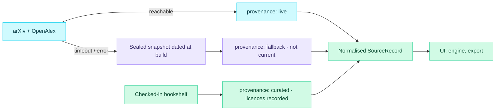

`npm run snapshot:build` regenerates the snapshot and its seal. The response envelope always states
`live` or `fallback`, and user-created rows are never produced by a source.

## The engine

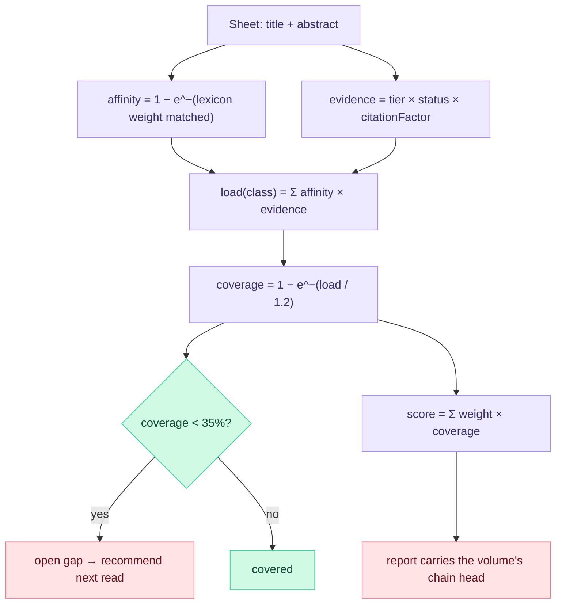

Sums saturate on purpose: a tenth survey on one topic cannot dominate a volume, and unread material
opens a gap without closing one (`queued` counts 0.2 of a `read` sheet; `rejected` counts zero).
Ties break on declared taxonomy order, then on ids, so output is stable.

## Integrity and replay

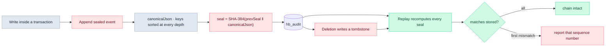

Canonical JSON sorts object keys recursively, preserves array order, normalises `-0` and **refuses**
non-finite numbers rather than dropping them silently. A deleted event surfaces as a sequence gap, not
a pass.

## Agent sequence

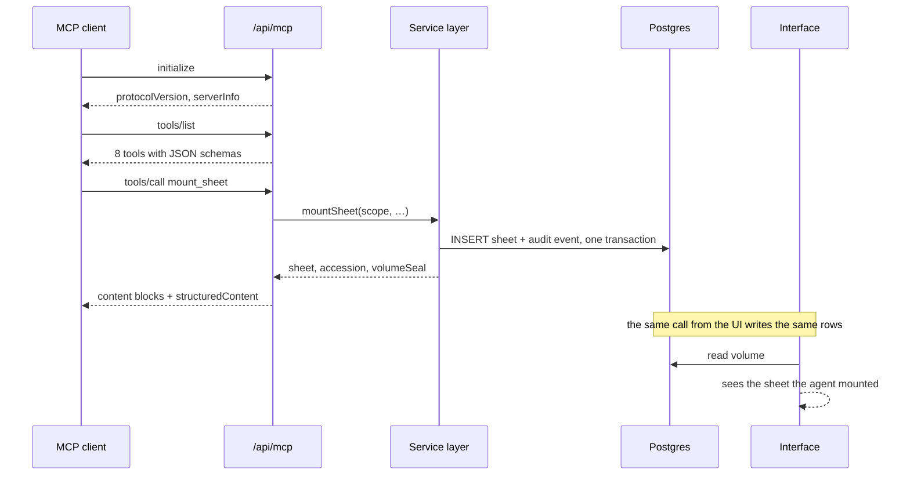

Scope comes from the transport, never from tool arguments, so a tool call cannot address another
session's records.

## User journey

```mermaid
flowchart LR
    classDef ok fill:#d1fae5,stroke:#34d399,color:#0d4b32
    classDef risk fill:#ffe4e6,stroke:#fb7185,color:#6b1220
    classDef infra fill:#e2e8f0,stroke:#94a3b8,color:#1e293b

    A["Open a volume"]:::infra --> B["Mount from live index"]:::ok
    B --> C["Read the sheet, PDF inline"]:::ok
    C --> D["Annotate the margin"]:::ok
    D --> E["Decide: admit / defer / reject"]:::ok
    E --> F["Run the coverage engine"]:::risk
    F --> G{"gap found?"}
    G -->|yes| H["recommend a next read"]:::risk
    G -->|no| I["export syllabus, BibTeX, CSV, JSON"]:::ok
    H --> I
    I --> J["Retire, keeping the chain replayable"]:::infra
```

## Deployment

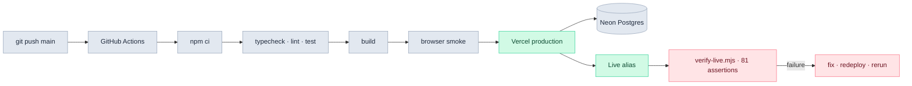

A production runtime without `DATABASE_URL` refuses to start rather than selecting the embedded
store. `/api/health` reports which adapter is actually in use, and the health panel on `/settings`
shows it to a reader.

## Security model

- **Ownership.** An unguessable 128-bit token in an HTTP-only cookie, or an `x-herbarium-scope`
  header for agents. Every read and write is filtered by it.
- **Input.** All external input is length-bounded and shape-checked before it reaches SQL, a URL or a
  page. Only `https` URLs on a fixed host allowlist are ingested or embedded.
- **Upstream.** Time-bounded fetches with one retry. A visitor's search string is stripped to letters,
  digits and spaces, so the discovery route cannot become an open proxy.
- **SQL.** Parameterised throughout. No user input is interpolated into a statement.
- **Errors.** A single envelope, correct status codes, and never a stack trace, SQL string or
  environment value.
- **Rate limits.** 40 writes, 20 mounts and 12 volume changes per window, per session, counted in the
  database so a cold start cannot reset them. Best-effort by design; see
  [SECURITY.md](SECURITY.md).
- **Third-party links** carry `target="_blank" rel="noopener noreferrer"`.

## A note on the licence

The application is MIT. The literature is not, and nothing here is mirrored:

- arXiv preprints belong to their authors and are licensed by them; PDFs stream from `arxiv.org`.
- NIST publications are works of the U.S. Government and in the public domain.
- Each bookshelf entry carries its own licence. A book with no free edition is deliberately absent.

**This is a reading aid, not a safety assessment.** Coverage describes what a volume has read, not
what is true about AI systems. Nothing here is advice about building or deploying them.

## 🗺️ Roadmap

### Now

- ✅ Mount live arXiv papers and twelve open-access books, with licence and reachability recorded.
- ✅ `herbarium-grade/1.0.0`: ten risk classes, itemised factors, sealed reports.
- ✅ MCP JSON-RPC 2.0 with eight tools, idempotent mounts and session scoping.
- ✅ SHA-384 audit chain with replay and known-answer tests.
- ✅ Four export formats, a read-only share route, and tombstones on deletion.

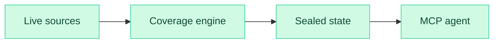

### Next

- **Per-class reading plans.** The engine names an open class; the next step is generating an ordered
  plan across the live index to close it, with the projected coverage change.
- **Volume diffing.** Compare two volumes side by side and show exactly which classes a change moved,
  with the factor arithmetic for each.
- **Watchlists.** A reader names a risk class and gets a live feed of new work matching its lexicon,
  so the gap stays closed rather than being re-opened by the literature.
- **Citation-graph coverage.** Weight a sheet by how its citations cluster, so mounting a landmark
  survey moves several classes at once.

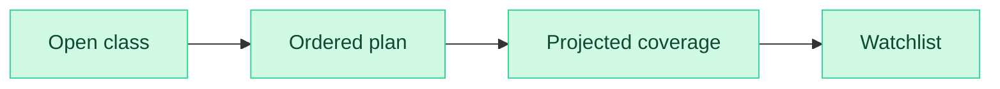

### Later

- **Coverage for a whole field.** Grade an organisation's public safety research against the same ten
  classes, published as a signed report anyone can replay.
- **Evaluation notebooks.** Export a coverage report plus its reading programme as a reproducible
  notebook, so a review is auditable end to end.
- **Local-first mode.** A sync protocol so a reader keeps a full offline copy and can replay chains
  without the deployment.

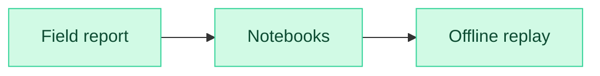

## 📄 Attribution

- arXiv, [arxiv.org](http://export.arxiv.org/api/query) — a Cornell University-operated preprint
  server. Content is licensed by its authors.
- OpenAlex, [openalex.org](https://api.openalex.org) — an open catalogue of scholarly works, CC0.
- [Dan Hendrycks, *Introduction to AI Safety, Ethics, and Society*](https://arxiv.org/abs/2411.01042) —
  CC BY-NC-ND.
- NIST AI 100-1 and AI 600-1 — U.S. Government works, public domain.

## 🤝 Contributing

Read [CONTRIBUTING.md](CONTRIBUTING.md). Security issues: [SECURITY.md](SECURITY.md).

## 📄 License

[MIT](LICENSE) © aniruddhaadak80